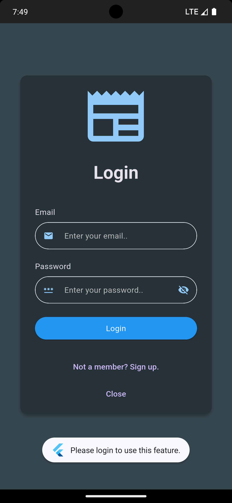
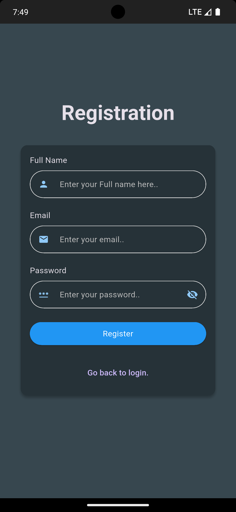

### Flutter News App

This is a sample news app example demonstrating Dependency Injection in your own Flutter project.

#### Requirements

- [Get-It](https://pub.dev/packages/get_it)
- [Injectable](https://pub.dev/packages/injectable)
- [BLoC](https://pub.dev/packages/flutter_bloc)
- [auto_route](https://pub.dev/packages/auto_route)
- [Equatable](https://pub.dev/packages/equatable)
- [Freezed](https://pub.dev/packages/freezed)
- [Retrofit](https://pub.dev/packages/retrofit)
- [Hive](https://pub.dev/packages/hive_flutter)

#### How to Add Dependencies

To add a dependency, all you need to do is call this code below:

```
@InjectableInit
void configureDependencies() => getIt.init();
```

To handle the generation file run this command on your terminal

```
flutter pub run build_runner build --delete-conflicting-outputs
```

It will generates a new file 'injection.config.dart', which will include all dependencies for all use cases.

and on your main func

```
void main() {
  configureInjection();
  ........
```

#### Environment Variables

You need to add the following variables to .env file.

```
API_BASE_URL="https://newsdata.io/api/1/"
API_KEY="API_KEY"

Get api key from here

```

<a href="https://newsdata.io"/>Generate api key.</a>

#### Screenshots

<table> 
<tr> 
  <td></td> 
  <td></td> 
  <td></td> 
  <td></td> 
  <td></td> 
  <td></td> 
</tr> 
</table>
